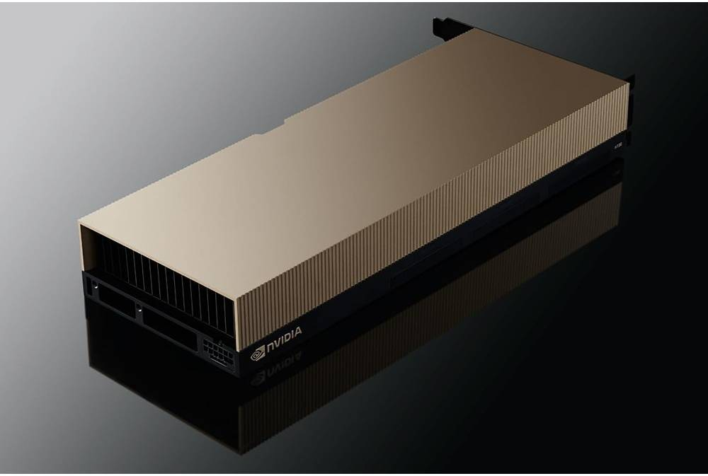
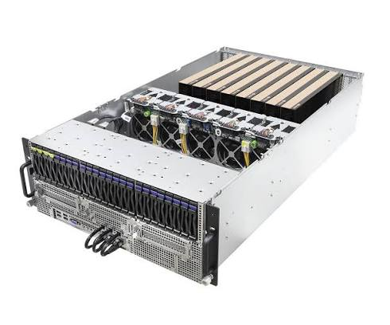
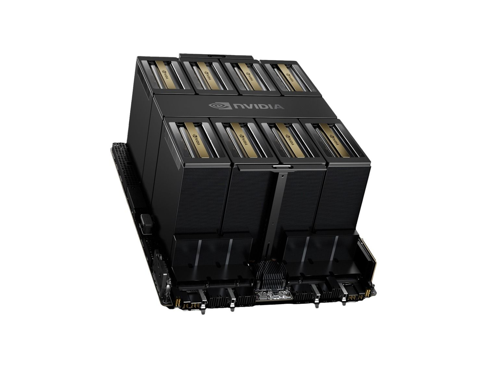
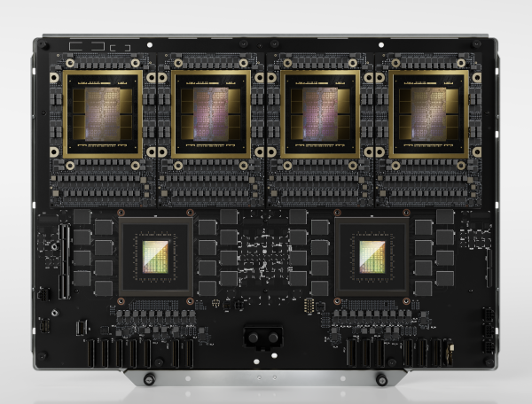
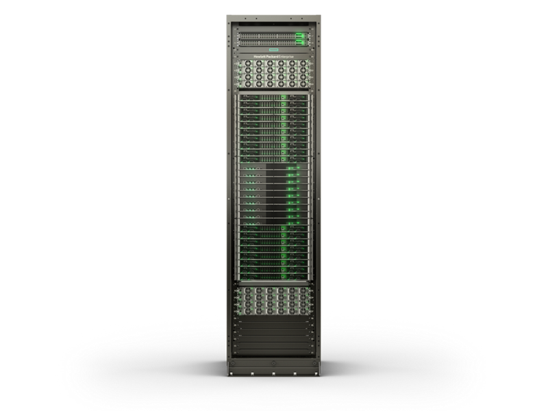
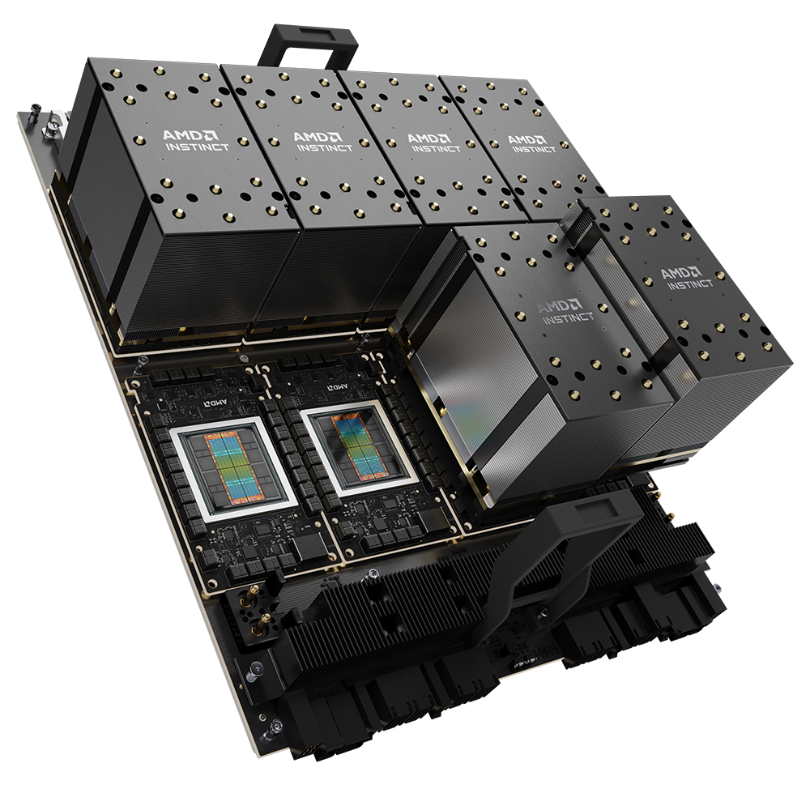
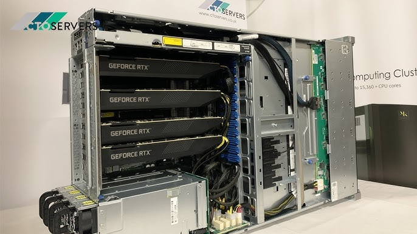

Last week I ended up at a table with a bunch of inference engineers. Within five minutes the conversation was flying: _"GB200s are great but the NVL72 power draw is brutal"_, _"H100s are fine if you're memory-bound anyway"_, _"MI300X gives you 192 gigs, CUDA moat or not."_ I did the thing we all do — nodded slowly, said "yeah, bandwidth," and quietly realized I couldn't have defined half those words with a gun to my head.

So I went home and did the other thing I always do: researched it until it made sense, and wrote the guide I wish someone had handed me before that dinner.

This post is that guide. No prior hardware knowledge assumed. By the end, you'll be able to read an NVIDIA or AMD spec sheet, decode names like **H200**, **GB200 NVL72**, and **MI355X** on sight, know what actually matters for _inference_ versus _training_, pick sensible hardware for a homelab, and understand why running a GPU datacenter is one of the hardest infrastructure jobs on earth right now.

If you read my earlier post about [running vLLM on a Mac Mini](/posts/vllm-cpu-inference-guide), this is the perfect companion — that one explained the _software_ of inference; this one explains the _metal_ it runs on.

---

## The 7 Words That Decode Everything

Here's the secret: GPU marketing sounds impenetrable, but nearly every spec sheet is built from the same seven concepts. Learn these and every product name becomes readable.

### 1. VRAM — the size of the workbench

VRAM (video RAM) is the memory that lives _on the GPU itself_. A model's weights must fit in VRAM to run at full speed — if they don't fit, you either quantize (shrink) the model, split it across multiple GPUs, or accept painful slowdowns spilling to system RAM.

The rule of thumb is beautifully simple: **memory needed ≈ number of parameters × bytes per parameter.** A 70B-parameter model at 16-bit precision (2 bytes per parameter) needs ~140 GB just for weights — before you add the KV cache for actual requests. That single line explains why datacenter GPUs are in an arms race over memory capacity, and why an 80 GB H100 can't hold a 70B model alone at full precision but a 192 GB MI300X can.

**VRAM decides which models you can run at all.** It is the first number to look at on any spec sheet.

### 2. HBM — why datacenter memory is special

Your gaming GPU uses **GDDR** memory — chips sitting on the circuit board _next to_ the GPU, connected by wires. Datacenter GPUs use **HBM** (High Bandwidth Memory) — DRAM dies literally **stacked vertically on top of each other**, 8 or 12 layers high like a tiny skyscraper, placed millimeters from the GPU die and connected through thousands of microscopic vertical channels.

Stacking gets you an enormously wider connection to memory, which buys the next concept:

### 3. Memory bandwidth — the speed limit of inference

Bandwidth is how fast the GPU can move data between its memory and its compute cores, measured in GB/s or TB/s. And here's the fact that changed how I read spec sheets forever:

> **For LLM inference, memory bandwidth usually matters more than raw compute.**

Remember from the vLLM post: generation happens one token at a time, and producing each token requires reading essentially _all_ the model weights out of memory. A 35 GB (quantized) model on a GPU with 1 TB/s of bandwidth can be read at most ~28 times per second — so ~28 tokens/sec is roughly your ceiling no matter how many TFLOPS the compute cores boast. The decode phase of inference is **memory-bound**: the compute units spend much of their time waiting for weights to arrive.

This is why the H200 exists (same compute as the H100, way more memory and bandwidth — and much faster at inference), and why enthusiasts say things like "the RTX 3090 is still relevant": its bandwidth is still decent, and bandwidth is what you feel.

**VRAM decides what fits. Bandwidth decides how fast the tokens come out.** Tattoo that somewhere.

### 4. Precision — FP32, FP16, FP8, FP4 and the incredible shrinking number

Every weight in a model is a number, and you can store numbers at different precisions:

| Format           | Bytes per number | Vibe                                            |
| ---------------- | ---------------- | ----------------------------------------------- |
| FP32             | 4                | Full precision — training's old default         |
| FP16 / BF16      | 2                | The workhorse — standard for training & serving |
| FP8              | 1                | Hopper's headline trick — 2× throughput         |
| FP4              | 0.5              | Blackwell's headline trick — 4× throughput      |
| INT4 (quantized) | 0.5              | What your homelab GGUF files use                |

Halving precision halves the memory a model needs _and_ roughly doubles how many numbers per second the hardware can chew through. Modern models tolerate lower precision remarkably well (with the right techniques), so each hardware generation races to support smaller formats natively. When NVIDIA claims Blackwell is "5× faster than Hopper," a large chunk of that is FP4 versus FP8 — same trick, smaller numbers. Now you know to ask: _faster at what precision?_

### 5. Compute — TFLOPS, and when they actually matter

TFLOPS = trillions of floating-point operations per second. It's the number in every keynote, and after everything above you might think it doesn't matter. It does — just for specific phases: **prefill** (reading your whole prompt in one parallel gulp is compute-hungry), **training**, and **large-batch serving** where many requests share each read of the weights. Modern GPUs do this math on **Tensor Cores** — specialized units built for the matrix multiplications that make up ~95% of a neural network's work.

### 6. Interconnect — NVLink, and why GPUs need to gossip

Once a model doesn't fit on one GPU, you split it across several — and now GPUs must exchange partial results constantly, mid-computation. Regular PCIe (how a GPU talks to the rest of a PC) moves roughly ~64 GB/s. NVIDIA's **NVLink** (generation 5) moves **1.8 TB/s per GPU** — nearly 30× more — and **NVSwitch** extends that so _every_ GPU in a rack talks to every other at full speed.

This is NVIDIA's quiet kingmaker. Anyone can build a fast chip; building the fabric that makes 72 chips behave like _one giant GPU_ is the harder trick, and it's half the reason the GB200 systems are special. (The other Rubik's cube here is **InfiniBand / RoCE** networking, which connects whole racks into training clusters of tens of thousands of GPUs — same idea, one level up.)

### 7. TDP — the power bill is a spec now

TDP is how much power (and heat) a chip produces at full tilt: ~350 W for a beefy gaming card, **700 W** for an H100, **~1,000 W** for a B200, **~1,400 W** for the top Blackwell Ultra and AMD MI355X parts — the last ones basically _require_ liquid cooling. When infra people say "we're power-constrained," they mean it literally: modern AI buildouts are gated by how many megawatts the local grid can deliver, not by how many GPUs money can buy.

---

## Decoding NVIDIA's Alphabet Soup

Armed with the vocabulary, NVIDIA's lineup stops being soup. Two rules unlock it:

**Rule 1 — the letter is the architecture generation, and each is named after a scientist:**

- **A** = Ampere (2020) — the A100, the chip GPT-3-era models trained on
- **H** = Hopper (2022) — named for Grace Hopper; the H100, _the_ chip of the ChatGPT boom
- **L** = Ada Lovelace (2023) — the L40S, a graphics-first sibling used for smaller inference
- **B** = Blackwell (2024–25) — named for statistician David Blackwell; current flagship generation
- **R** = Rubin (arriving late 2026) — named for astronomer Vera Rubin; HBM4-based next generation

**Rule 2 — a "G" prefix means a Grace CPU is glued on.** GB200 isn't a GPU — it's a _superchip_: NVIDIA's 72-core Arm CPU ("Grace" — yes, also named after Grace Hopper) packaged together with Blackwell GPUs on one board.

Now the name game becomes easy. Here are the cards:

### H100 — the chip that ate the world

_The H100 in its PCIe form — the gold slab that launched a thousand funding rounds._

- **Generation:** Hopper (2022) · **Memory:** 80 GB HBM3 · **Bandwidth:** 3.35 TB/s · **Power:** up to 700 W
- **What it is:** the default currency of the AI boom. When someone says "a cluster of GPUs," they usually still mean H100s. First generation with native FP8 and the Transformer Engine.
- **Order of magnitude:** tens of thousands of dollars to buy; a few dollars per hour to rent in the cloud.
- **One thing to say at dinner:** "The H100 was so scarce in 2023–24 that startups raised funding rounds _on the strength of having reserved some_."

### H200 — same brain, bigger memory

_Hopper-class GPUs the way they're actually deployed: eight to a server, with the fans and cabling to match._

- **Generation:** Hopper refresh (2024) · **Memory:** 141 GB HBM3e · **Bandwidth:** 4.8 TB/s · **Power:** 700 W
- **What it is:** the _same compute_ as the H100 with ~76% more memory and ~43% more bandwidth. And because inference is memory-bound (concept #3!), that alone made it dramatically better at serving big models. The H200 is the cleanest proof in the whole lineup that memory, not TFLOPS, is the inference bottleneck.

### B200 — Blackwell, the two-headed monster

_The HGX B200 board: eight Blackwell GPUs, one NVLink fabric, and heatsinks the size of shoeboxes — this is what "an 8-GPU server" means physically._

- **Generation:** Blackwell (2024–25) · **Memory:** 192 GB HBM3e · **Bandwidth:** 8 TB/s · **Power:** ~1,000 W
- **What it is:** two GPU dies fused into one package (chips hit the physical size limit a lithography machine can print — called the _reticle limit_ — so NVIDIA printed two and stitched them with a 10 TB/s bridge). 208 billion transistors. First generation with native FP4.
- **There's also a B300 ("Blackwell Ultra")** — same generation pushed further: 288 GB of HBM3e and ~50% more FP4 compute, at a spicy ~1,400 W.

### GB200 — not a GPU, a superchip

_A GB200 NVL72 compute tray — two GB200 superchips side by side: the four large gold packages up top are Blackwell GPUs, the two below are Grace CPUs._

- **What it is:** 1 Grace CPU + 2 B200 GPUs on one board, linked by a 900 GB/s die-to-die connection so the CPU's memory acts as spill-over space for the GPUs. When your dinner companions compare "GB200 vs H100," they're comparing a _board with two GPUs and a CPU_ against one GPU — now you can smile knowingly.
- **GB300** is the same idea with B300s — nearly 800 GB of combined fast memory on a single board.

### GB200 NVL72 — the rack that thinks it's one GPU

_A full NVL72-class rack (this one an HPE build). Every tray you can count is more compute than an entire 2019 datacenter row._

- **What it is:** 36 GB200 superchips (72 GPUs + 36 CPUs) in a single liquid-cooled rack, wired with NVLink/NVSwitch so all 72 GPUs share memory at 1.8 TB/s each — software can treat the rack as **one giant accelerator with ~13.5 TB of HBM**.
- **The stats are absurd:** it weighs well over a tonne, draws ~120 kW (about a hundred homes' worth of power in one rack), and cannot be air-cooled. When AI-lab press releases brag about "NVL72s," this is the object. Rough cost: **millions per rack** — you rent these, you don't buy them.

### The supporting cast

- **DGX** = a complete NVIDIA-built server (classically 8 GPUs) — the "buy the whole appliance" option.
- **HGX** = the GPU baseboard NVIDIA sells to Dell/Supermicro/etc. to build their own servers around.
- **SXM vs PCIe** = form factors: SXM modules bolt directly onto the board for max power and NVLink; PCIe cards slot into normal servers with lower limits. Same chip name, meaningfully different performance.
- **Rubin (VR200)** = what everyone's waiting for in late 2026: HBM4 memory, 288 GB per GPU, ~13 TB/s bandwidth, and a "Vera" CPU. The treadmill never stops.

---

## The Challengers: AMD and the Non-GPU Rebels

### AMD Instinct — the memory-first strategy

_AMD's Instinct platform, heatsinks off on two modules — the exposed packages show the chiplet design: compute dies surrounded by stacks of HBM._

AMD's datacenter line is **Instinct**, on the **CDNA** architecture, and its strategy has been consistent: _win on memory._

| Chip   | Year | Memory       | Bandwidth | Notes                                                                             |
| ------ | ---- | ------------ | --------- | --------------------------------------------------------------------------------- |
| MI300X | 2023 | 192 GB HBM3  | 5.3 TB/s  | 2.4× the H100's memory, same year                                                 |
| MI325X | 2024 | 256 GB HBM3e | 6 TB/s    | Memory bump of the same silicon                                                   |
| MI355X | 2025 | 288 GB HBM3e | 8 TB/s    | CDNA 4, native FP4, ~1,400 W — trades blows with the B200 on inference benchmarks |

Since inference is memory-bound, more memory per GPU means fewer GPUs per model, simpler deployments, and often better cost per token. On paper the MI355X matches or beats B200 in several published inference results. So why isn't AMD everywhere?

**CUDA.** NVIDIA's software platform has ~18 years of libraries, tooling, and muscle memory; AMD's equivalent, **ROCm**, is far younger. The honest mid-2026 assessment: the mainstream path — PyTorch and vLLM on Instinct — works well now (vLLM ships official ROCm support), but stray off it into custom kernels or the long tail of GPU libraries and you'll hit rough edges NVIDIA users never see. This is the famous **"CUDA moat"**, and it's why AMD sells single-digit market share against a technically comparable product. Their pitch is simple: more memory per dollar, if your stack fits the paved road.

### The ones that aren't GPUs at all

A GPU is a _general-purpose_ parallel machine that happens to be great at AI. A growing crowd asks: what if you design silicon _only_ for neural networks?

- **Google TPU** — the OG custom AI chip (2015), built around a _systolic array_ (a grid that pumps matrix math through like a heart pumps blood). The 2025 generation, **Ironwood (v7)**, is the first TPU designed _specifically for inference_, scaling to pods of 9,216 chips. You can't buy one; you rent them on Google Cloud. Gemini is trained and served on these.
- **AWS Trainium** — Amazon's answer, same playbook: custom chip, only rentable on AWS. Fun fact with a personal angle: **Anthropic runs major Claude workloads on massive Trainium clusters** (the "Project Rainier" buildout) — the assistant helping me draft this post quite possibly ran on one.
- **Groq LPU** — a radical bet: no external memory at all, just ultra-fast on-chip SRAM (a couple hundred MB per chip), so one model spreads across _hundreds_ of chips. The result is absurdly fast, deterministic token generation — hundreds of tokens/sec where GPUs manage dozens. Inference only; it can't train anything.
- **Cerebras WSE-3** — the most metal answer possible: don't cut the silicon wafer into chips, **use the entire wafer as one chip**. Dinner-plate-sized, ~4 _trillion_ transistors, 900,000 cores, 44 GB of on-chip SRAM. Also famous for very fast inference serving.

The pattern: none of these beat NVIDIA at everything. Each wins one dimension — cost (TPU/Trainium at hyperscale), latency (Groq, Cerebras), or vertical integration — and that's enough to carve a niche. Meanwhile every hyperscaler (Google, Amazon, Microsoft with Maia, Meta with MTIA) is building its own silicon to escape the NVIDIA tax, which tells you where the industry thinks the margins are.

---

## Which Hardware for Which Job

The tier list, from living room to hyperscale:

### Tier 1: Homelab / enthusiast (hundreds to a few thousand $)

_The enthusiast end of the spectrum: consumer GeForce cards racked up for inference duty._

The two-number rule from concept #1 and #3 is your entire buying guide: **VRAM decides which models fit; bandwidth decides tokens per second.** TFLOPS are nearly irrelevant for single-user inference.

| Option           | Memory                 | Rough class              | The trade                                                                                                                         |
| ---------------- | ---------------------- | ------------------------ | --------------------------------------------------------------------------------------------------------------------------------- |
| Used RTX 3090    | 24 GB GDDR6X           | Under a grand            | Still the classic first build — six years old and still the best value in VRAM                                                    |
| RTX 4090         | 24 GB                  | A couple grand           | Faster prefill, same fit-limit as the 3090                                                                                        |
| RTX 5090         | 32 GB GDDR7, 1.8 TB/s  | A few grand              | Best consumer card, period — that bandwidth rivals datacenter parts                                                               |
| Mac Studio       | up to 512 GB _unified_ | Few grand → five figures | The dark horse: unified memory means the GPU can use _all_ of it, so giant models fit — at lower bandwidth, so tokens flow slower |
| NVIDIA DGX Spark | 128 GB unified         | A few grand              | A desktop Grace-Blackwell dev box — CUDA-native big-model tinkering, but modest bandwidth                                         |

A 24 GB card runs quantized models up to ~30B parameters comfortably. The Mac path inverts the trade: enormous capacity, moderate speed. There is no free lunch, only the VRAM/bandwidth trade served two ways.

### Tier 2: Startup / on-prem serving (tens of thousands per GPU)

This is L40S, H100, H200 and MI300X territory — served 8 to a box (that's the "HGX" server) or rented per-hour from clouds like Lambda, CoreWeave, or the hyperscalers. The mid-2026 sweet spot for serving big open models is the H200 or MI300X class: enough memory to hold a 70B model on one or two GPUs at production speed. Practical wisdom from the inference crowd: **renting almost always beats buying** until your utilization is consistently high — a GPU sitting idle is the most expensive paperweight in the building.

### Tier 3: Frontier / hyperscale (millions per rack, billions per site)

GB200/GB300 NVL72 racks, TPU pods, Trainium clusters. At this tier the unit of purchase isn't a GPU — it's a _building_: land, substations, megawatts, water, and tens of thousands of accelerators woven together with NVLink and InfiniBand. Which brings us to the part of the dinner conversation that finally made sense to me last.

---

## Why Running This Stuff Is Genuinely Hard

I used to think GPU infrastructure meant "buy GPUs, plug in, profit." The reality is closer to running a power plant, a plumbing business, and a distributed-systems PhD program simultaneously.

**Power is the wall.** One NVL72 rack pulls ~120 kW — a typical _entire rack_ of normal servers pulls 5–15 kW. AI datacenters are now sized in hundreds of megawatts and sited next to power plants, and the honest answer to "why can't we build more AI capacity" is usually _the grid_, not the chips.

**Cooling went liquid.** At 1,000+ W per chip, air is over. Modern AI racks run direct liquid cooling — cold plates on every chip, coolant loops through the rack, facility water systems behind that. A leak is now a datacenter incident category.

**Things break constantly.** My favorite stat in all of AI infrastructure: during Meta's Llama 3 training run on 16,384 H100s, the cluster suffered **419 unexpected interruptions in 54 days — roughly one hardware failure every three hours**, mostly GPUs and their memory. At scale, failure is not an event; it's a _rate_. Whole engineering teams exist just for checkpointing, health-checking, and hot-swapping — because when one GPU in a tightly-coupled job dies, thousands of its friends stop and wait.

**Utilization is the real business.** These machines depreciate brutally, so idle time is money on fire — and even _busy_ clusters typically extract only 30–50% of theoretical FLOPS on real workloads (a metric called **MFU**). Squeezing out more is precisely the skill of the people at that dinner table.

**Don't take my word for it — walk through one.** The best half hour you can spend on this topic is ServeTheHome's tour inside xAI's Colossus — the 100,000-GPU cluster built in 122 days. Everything above (liquid cooling loops, power distribution, the sheer physicality of NVLink cabling) is on camera:

<iframe style="width:100%;aspect-ratio:16/9;border:0;border-radius:8px;" src="https://www.youtube-nocookie.com/embed/Jf8EPSBZU7Y" title="Inside the World's Largest AI Supercluster xAI Colossus — ServeTheHome" allow="accelerometer; clipboard-write; encrypted-media; gyroscope; picture-in-picture; web-share" allowfullscreen loading="lazy"></iframe>

_[Inside the World's Largest AI Supercluster xAI Colossus](https://www.youtube.com/watch?v=Jf8EPSBZU7Y) — ServeTheHome. Watch for the rear-door heat exchangers and the Tesla Megapacks buffering the power spikes from training runs._

**Splitting models is an art.** Fitting a model onto many GPUs has an entire vocabulary of its own — **tensor parallelism** (slice every layer across GPUs), **pipeline parallelism** (deal out layers like cards), **data parallelism** (clone the model, split the data), **expert parallelism** (scatter a Mixture-of-Experts). Every choice trades memory against interconnect traffic against latency — this is where hardware knowledge and the software knowledge from the vLLM post fuse into one discipline.

---

## Cocktail-Party Facts

The section you'll actually remember:

- **The architecture names honor scientists**: Grace Hopper (pioneering programmer), David Blackwell (statistician), Ada Lovelace, Vera Rubin (astronomer who proved dark matter's existence). A "GH200" is literally a chip named _Grace Hopper_.
- **Gram for gram, an H100 die embarrasses gold.** The actual silicon die weighs a few grams and the module sells for tens of thousands of dollars — per gram, orders of magnitude beyond bullion.
- **A B200 has 208 billion transistors.** The first Pentium had 3.1 million. That's a ~67,000× jump in one working lifetime.
- **One NVL72 rack ≈ 100 homes** of continuous power draw. A large AI datacenter campus draws more power than a small city.
- **Nearly every serious AI chip comes from one company** — TSMC fabs NVIDIA, AMD, TPUs, Trainium, and Apple Silicon alike. The deepest bottleneck isn't even the chips; it's TSMC's advanced _packaging_ capacity (CoWoS) — the step that bonds HBM stacks next to GPU dies.
- **HBM turned memory-makers into kingmakers**: SK Hynix, Samsung, and Micron's HBM lines are sold out years ahead, and GPU launch dates quietly bend around memory supply.
- **The H100 shortage got so severe in 2023–24** that GPU allocations were startup fundraising collateral and cloud contracts were signed years ahead for hardware that didn't exist yet.

---

## The Cheat Sheet

Screenshot this bit.

| Buzzword                                 | Plain English                                                                                 |
| ---------------------------------------- | --------------------------------------------------------------------------------------------- |
| **VRAM**                                 | GPU's onboard memory. Decides which models fit.                                               |
| **HBM / HBM3e / HBM4**                   | Vertically-stacked memory on datacenter GPUs. Successive generations = more capacity + speed. |
| **Memory bandwidth**                     | How fast weights stream from memory. **The** inference speed limit.                           |
| **FP16 / FP8 / FP4**                     | Number precision. Smaller = less memory, more speed, per-generation marketing headline.       |
| **TFLOPS / Tensor Cores**                | Raw math muscle. Matters for training, prefill, and big batches.                              |
| **TDP**                                  | Power draw. 700 W (H100) → ~1,400 W (B300/MI355X). Liquid cooling territory.                  |
| **NVLink / NVSwitch**                    | NVIDIA's GPU-to-GPU fabric, ~30× PCIe. The moat under the moat.                               |
| **A100 / H100 / H200**                   | Ampere (2020) and Hopper (2022/24) generations. H200 = H100 + much more memory.               |
| **B200 / B300**                          | Blackwell (current): dual-die, FP4, 192/288 GB.                                               |
| **GB200 / GB300**                        | _Superchip_: Grace CPU + 2 Blackwell GPUs on one board. Not a GPU!                            |
| **NVL72**                                | 72-GPU liquid-cooled rack acting as one giant accelerator. ~120 kW.                           |
| **DGX / HGX**                            | NVIDIA's full server / the GPU board OEMs build servers around.                               |
| **SXM vs PCIe**                          | Bolt-on module (full power + NVLink) vs regular slot-in card (less of both).                  |
| **Rubin**                                | NVIDIA's next generation (late 2026): HBM4, 288 GB, ~13 TB/s.                                 |
| **MI300X / MI325X / MI355X**             | AMD Instinct line: 192 → 256 → 288 GB. The memory-first challenger.                           |
| **CUDA / ROCm**                          | NVIDIA's mature software moat / AMD's younger equivalent.                                     |
| **TPU / Trainium**                       | Google's and Amazon's custom chips — rent-only, hyperscale economics.                         |
| **Groq / Cerebras**                      | Speed-demon inference chips: SRAM-only design / whole-wafer chip.                             |
| **Tensor / pipeline / data parallelism** | The three classic ways to split a model across GPUs.                                          |
| **MFU**                                  | Fraction of theoretical FLOPS you actually achieve. 30–50% is normal. Humbling.               |

---

## Closing Thought

Here's what actually changed for me writing this: I stopped hearing product names and started hearing **trade-offs**. "GB200 NVL72" now parses as _maximum interconnect, maximum power problem_. "MI355X" parses as _memory-per-dollar bet against the CUDA moat_. "Used 3090" parses as _bandwidth per dollar, and 24 GB decides what fits_.

That's the whole trick. The spec sheet has seven numbers that matter, every chip is a different weighting of them, and every heated dinner-table debate is really about which number matters for _your_ workload. Next time the inference geeks get going, you won't be nodding along.

You'll be the one asking, _"Sure, but at what precision?"_

---

_Found an error, or an inference geek with a correction? I'd genuinely love to hear it — this field moves fast enough that some number above is probably already stale._
